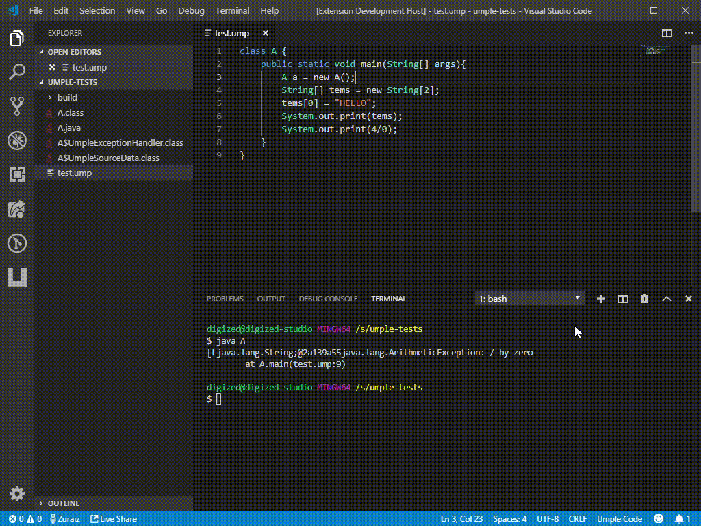
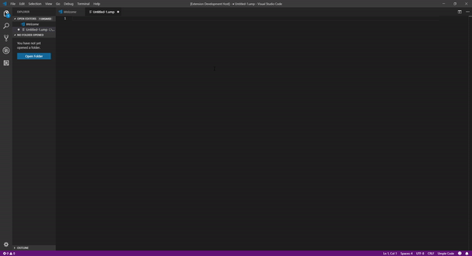

# umple README

A language extension for the [Umple](http://cruise.site.uottawa.ca/umple/) Modeling tool and programming language.

Umple is a modeling tool and programming language family to enable what we call Model-Oriented Programming. It adds abstractions such as Associations, Attributes and State Machines derived from UML to object-oriented programming languages such as Java, C++, PHP and Ruby. Umple can also be used to create UML class and state diagrams textually.
## Features

- Syntax Highlighting.
- Linting.
- Umple panel.
- Quickly generate and compile code.
- Snippets.
    - generate a class.

## Release Notes

### 1.0.2

- Minor textual changes
- Compile doesn't require a main class anymore

### 1.0.1

- Add support for error and warning highlighting. 
- Umple is now packaged with the extension for easier use.
- sidebar to access commands easier

### 1.0.0

Initial release of umple language. 
- syntax highlighting
- basic snippets
